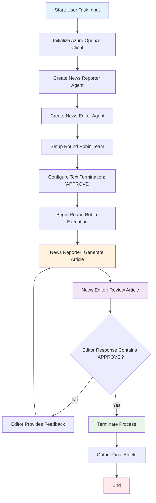
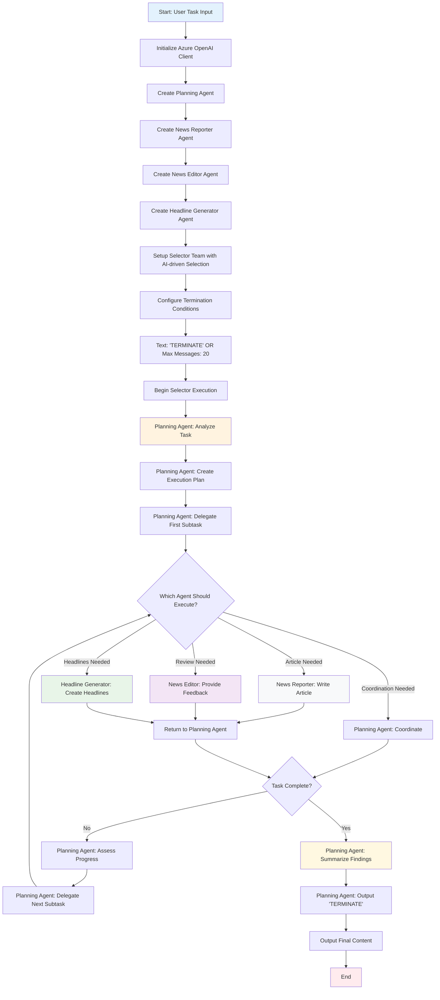
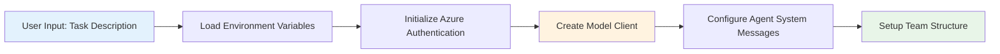
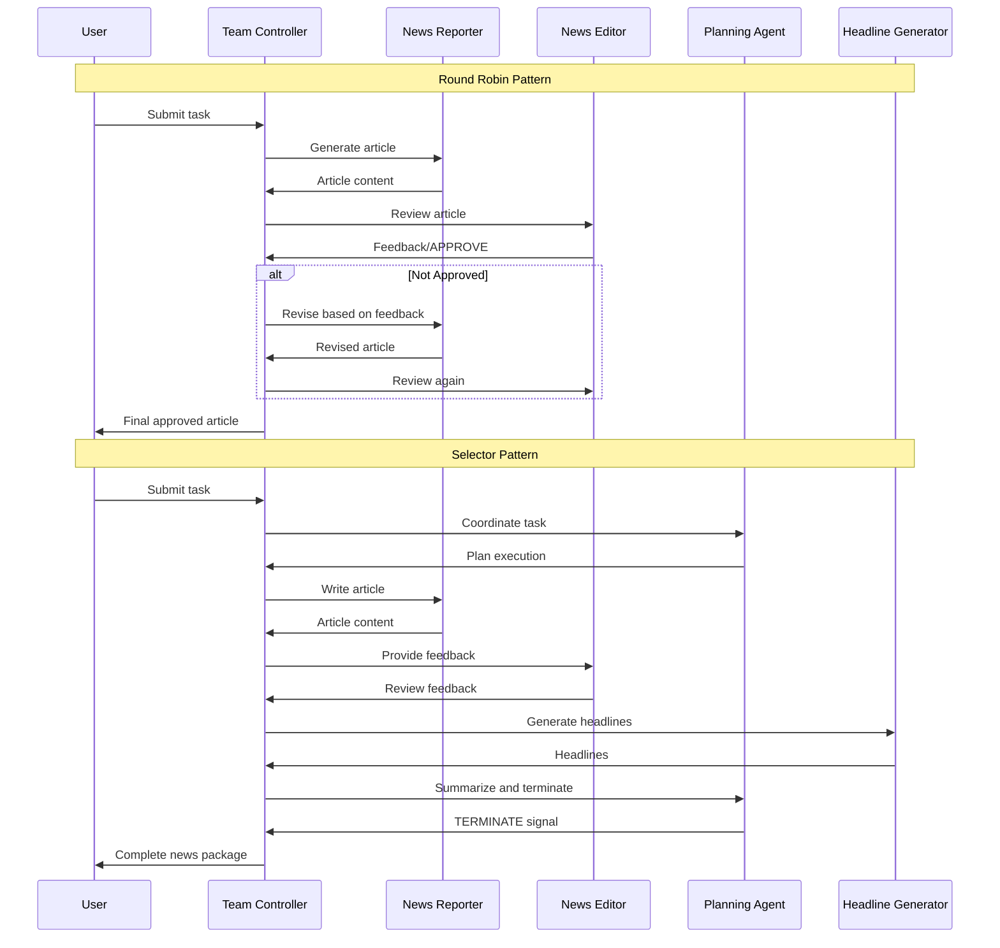
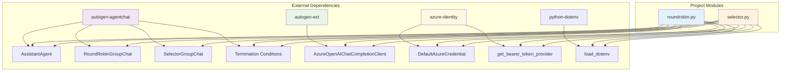
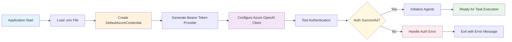
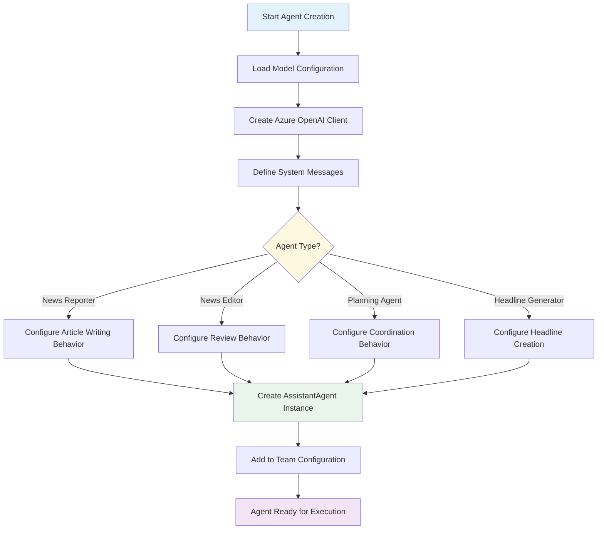

# Development Guide - AutogenAgents-NewsReporter

## Referenced Files
- [roundrobin.py](../roundrobin.py) - Round Robin implementation
- [selector.py](../selector.py) - Selector pattern implementation
- [requirements.txt](../requirements.txt) - Dependencies
- [.env](../.env) - Environment configuration

## Core Logic and Data Flow

### Round Robin Pattern Workflow

The Round Robin pattern implements a simple sequential agent execution model where agents take turns in a predefined order.



### Selector Pattern Workflow

The Selector pattern uses AI-driven agent selection where a planning agent coordinates task delegation among specialized agents.



### Data Processing Steps

#### Input Processing


#### Agent Interaction Flow


## Module Interactions and Dependencies

### Module Dependency Graph


### Critical Processes

#### Authentication Flow


#### Agent Initialization Process


## Setup and Configuration

### Environment Setup

#### Prerequisites Installation
```bash
# Create virtual environment
python -m venv autogen-env
source autogen-env/bin/activate  # Linux/Mac
# autogen-env\Scripts\activate  # Windows

# Install dependencies
pip install -r requirements.txt

# Verify installation
python -c "import autogen_agentchat; print('AutoGen installed successfully')"
```

#### Azure Configuration
```bash
# Azure CLI login (for local development)
az login

# Verify Azure OpenAI access
az cognitiveservices account list --resource-group your-resource-group

# Test authentication
python -c "from azure.identity import DefaultAzureCredential; DefaultAzureCredential().get_token('https://cognitiveservices.azure.com/.default')"
```

### Configuration Examples

#### Environment Variables Template (.env)
```bash
# Azure OpenAI Configuration
api_key=your_azure_openai_api_key_here
model-name=your_model_deployment_name
api-version=2024-02-15-preview
azure_endpoint=https://your-resource.openai.azure.com/

# Optional: Azure AD Configuration (if using managed identity)
AZURE_CLIENT_ID=your_client_id
AZURE_CLIENT_SECRET=your_client_secret
AZURE_TENANT_ID=your_tenant_id
```

#### Model Configuration Details
```python
# Model information structure used in both patterns
model_info = {
    "id": "your-model-deployment-name",
    "object": "model",
    "created": 0,
    "owned_by": "azure-openai",
    "root": "your-model-deployment-name",
    "parent": None,
    "permission": [],
    "model_type": "chat",
    "vision": False,
    "function_calling": False,
    "json_output": False,
    "structured_output": False,
    "family": "gpt-5",
}
```

### Usage Examples

#### Running Round Robin Pattern
```python
# Basic execution
import asyncio
from roundrobin import main

# Run with custom task
async def custom_task():
    # Modify the task in roundrobin.py or pass as parameter
    await main()

asyncio.run(custom_task())
```

#### Running Selector Pattern
```python
# Basic execution
import asyncio
from selector import main

# Run with monitoring
async def monitored_execution():
    start_time = time.time()
    await main()
    execution_time = time.time() - start_time
    print(f"Execution completed in {execution_time:.2f} seconds")

asyncio.run(monitored_execution())
```

#### Custom Agent Configuration
```python
# Creating custom agents with modified behavior
custom_reporter = AssistantAgent(
    "Custom_News_Reporter",
    model_client=az_model_client,
    system_message=(
        "You are a specialized financial news reporter. "
        "Focus on market trends, economic indicators, and business impact. "
        "Keep articles concise and data-driven."
    ),
)

# Custom termination conditions
custom_termination = TextMentionTermination("FINAL_APPROVAL") | MaxMessageTermination(15)
```

## Troubleshooting

### Common Issues and Solutions

#### 1. Authentication Failures
```python
# Debug authentication issues
from azure.identity import DefaultAzureCredential
from azure.core.exceptions import ClientAuthenticationError

try:
    credential = DefaultAzureCredential()
    token = credential.get_token("https://cognitiveservices.azure.com/.default")
    print(f"Authentication successful. Token expires: {token.expires_on}")
except ClientAuthenticationError as e:
    print(f"Authentication failed: {e}")
    # Check: Azure CLI login, environment variables, managed identity configuration
```

#### 2. Model Access Issues
```python
# Test Azure OpenAI connectivity
import openai
from azure.identity import get_bearer_token_provider, DefaultAzureCredential

try:
    token_provider = get_bearer_token_provider(
        DefaultAzureCredential(), 
        "https://cognitiveservices.azure.com/.default"
    )
    token = token_provider()
    print(f"Token obtained: {token[:20]}...")
except Exception as e:
    print(f"Token provider failed: {e}")
```

#### 3. Environment Configuration Validation
```python
# Validate all required environment variables
import os
from dotenv import load_dotenv

load_dotenv()

required_vars = ["model-name", "api-version", "azure_endpoint"]
missing_vars = [var for var in required_vars if not os.getenv(var)]

if missing_vars:
    print(f"Missing environment variables: {missing_vars}")
else:
    print("All required environment variables are set")
```

### Performance Optimization

#### Response Time Optimization
```python
# Implement timeout and retry logic
import asyncio
from azure.core.exceptions import ServiceRequestTimeoutError

async def robust_agent_execution(team, task, max_retries=3):
    for attempt in range(max_retries):
        try:
            result = await asyncio.wait_for(
                team.run(task=task), 
                timeout=300  # 5 minute timeout
            )
            return result
        except asyncio.TimeoutError:
            print(f"Timeout on attempt {attempt + 1}")
            if attempt == max_retries - 1:
                raise
        except ServiceRequestTimeoutError:
            print(f"Service timeout on attempt {attempt + 1}")
            await asyncio.sleep(2 ** attempt)  # Exponential backoff
```

#### Memory Usage Optimization
```python
# Monitor and optimize memory usage
import psutil
import gc

def monitor_memory_usage():
    process = psutil.Process()
    memory_info = process.memory_info()
    print(f"Memory usage: {memory_info.rss / 1024 / 1024:.2f} MB")
    
    # Force garbage collection if memory usage is high
    if memory_info.rss > 500 * 1024 * 1024:  # 500 MB threshold
        gc.collect()
```

### Development Best Practices

#### Error Handling Pattern
```python
import logging
from autogen_agentchat.base import TaskResult

# Configure logging
logging.basicConfig(level=logging.INFO)
logger = logging.getLogger(__name__)

async def safe_team_execution(team, task):
    try:
        logger.info(f"Starting task execution: {task[:50]}...")
        result = await team.run(task=task)
        logger.info("Task completed successfully")
        return result
    except Exception as e:
        logger.error(f"Task execution failed: {e}")
        # Implement fallback behavior or graceful degradation
        return TaskResult(
            stop_reason="error",
            messages=[{"role": "system", "content": f"Error occurred: {e}"}]
        )
```

#### Testing Framework
```python
import pytest
import asyncio

class TestAgentPatterns:
    @pytest.mark.asyncio
    async def test_round_robin_execution(self):
        """Test Round Robin pattern with mock task"""
        # Import and configure test environment
        from roundrobin import News_Reporter, News_Editor, team
        
        test_task = "Write a test article about Python programming"
        result = await team.run(task=test_task)
        
        assert result.stop_reason == "text_mention"
        assert any("APPROVE" in msg.content for msg in result.messages)
    
    @pytest.mark.asyncio
    async def test_selector_execution(self):
        """Test Selector pattern with mock task"""
        from selector import team
        
        test_task = "Create a brief news article about AI technology"
        result = await team.run(task=test_task)
        
        assert result.stop_reason in ["text_mention", "max_messages"]
        assert len(result.messages) > 0
```

### Monitoring and Debugging

#### Agent Interaction Logging
```python
# Enhanced logging for agent interactions
import json
from datetime import datetime

class AgentInteractionLogger:
    def __init__(self, log_file="agent_interactions.log"):
        self.log_file = log_file
    
    def log_interaction(self, agent_name, message_type, content, metadata=None):
        log_entry = {
            "timestamp": datetime.utcnow().isoformat(),
            "agent": agent_name,
            "message_type": message_type,
            "content": content[:200] + "..." if len(content) > 200 else content,
            "metadata": metadata or {}
        }
        
        with open(self.log_file, "a") as f:
            f.write(json.dumps(log_entry) + "\n")
```

#### Performance Metrics Collection
```python
# Collect and analyze performance metrics
import time
from collections import defaultdict

class PerformanceMonitor:
    def __init__(self):
        self.metrics = defaultdict(list)
    
    def start_timer(self, operation):
        self.metrics[f"{operation}_start"].append(time.time())
    
    def end_timer(self, operation):
        start_times = self.metrics[f"{operation}_start"]
        if start_times:
            duration = time.time() - start_times.pop()
            self.metrics[f"{operation}_duration"].append(duration)
    
    def get_average_duration(self, operation):
        durations = self.metrics[f"{operation}_duration"]
        return sum(durations) / len(durations) if durations else 0
```

This development guide provides comprehensive information for understanding, implementing, and troubleshooting the AutogenAgents-NewsReporter project with detailed flowcharts and practical examples.