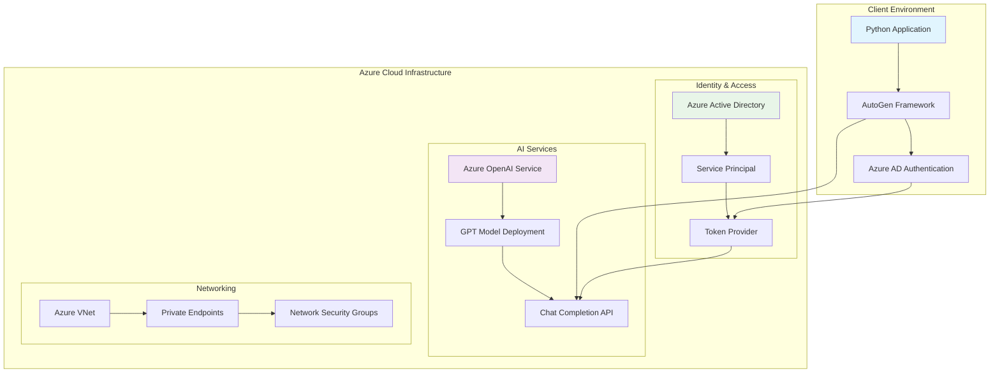
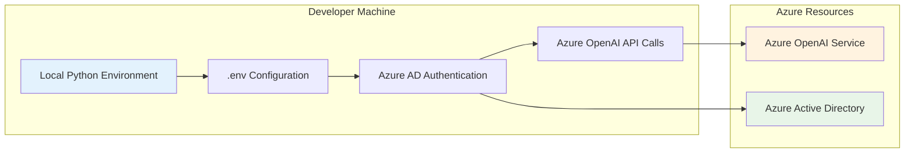
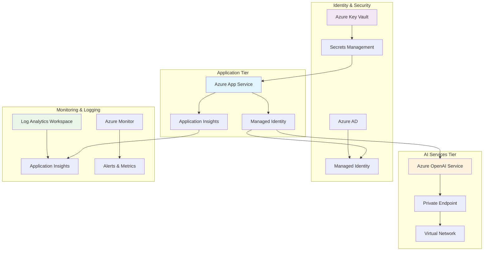
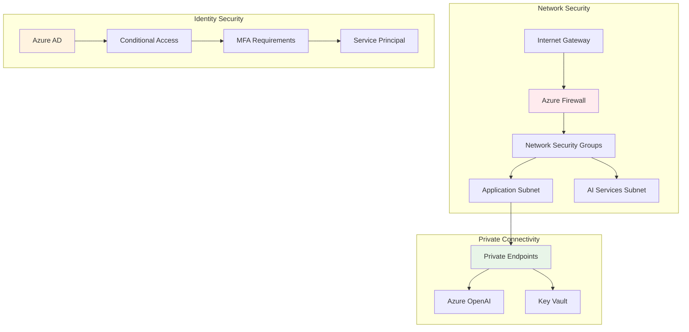
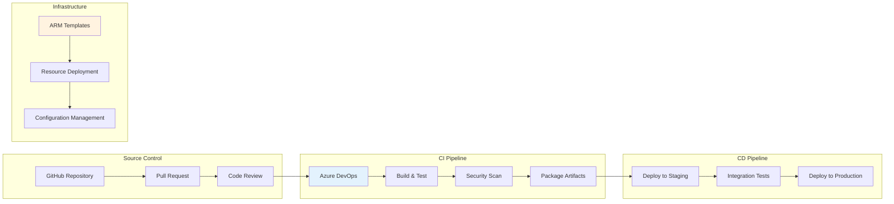
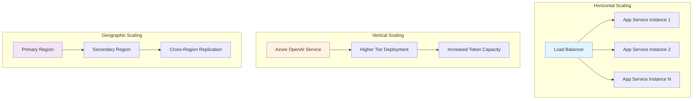

# Infrastructure Design - AutogenAgents-NewsReporter

## Referenced Files
- [roundrobin.py](../roundrobin.py:17) - Azure authentication implementation
- [selector.py](../selector.py:15) - Token provider configuration
- [requirements.txt](../requirements.txt) - Infrastructure dependencies

## System Architecture Overview

The AutogenAgents-NewsReporter project follows a **serverless, cloud-native architecture** leveraging Azure services for AI model hosting, authentication, and scalable execution.



## Core Infrastructure Components

### 1. Azure OpenAI Service

**Resource Type**: Cognitive Services - OpenAI
- **SKU**: Standard (Pay-per-use)
- **Region**: Recommended regions with GPT-5 availability
- **Model Deployments**: 
  - GPT-5 model with custom deployment name
  - Configurable via environment variables

**Configuration Requirements**:
```json
{
  "deployment_name": "<custom-deployment-name>",
  "model_version": "gpt-5",
  "api_version": "2024-02-15-preview",
  "capacity": {
    "tokens_per_minute": 30000,
    "requests_per_minute": 180
  }
}
```

### 2. Azure Active Directory (AAD)

**Resource Type**: Identity Provider
- **App Registration**: Required for service principal authentication
- **API Permissions**: 
  - `https://cognitiveservices.azure.com/.default`
- **Authentication Flow**: Client credential flow with managed identity support

**Required Permissions**:
- Cognitive Services User role on Azure OpenAI resource
- Reader role for resource group (optional, for monitoring)

### 3. Compute Environment

**Local Development**:
- Python 3.8+ runtime environment
- Virtual environment for dependency isolation
- Environment variable management via `.env` files

**Production Considerations**:
- **Azure Container Instances**: For serverless execution
- **Azure Functions**: For event-driven scenarios
- **Azure App Service**: For web-based implementations
- **Azure Kubernetes Service**: For enterprise-scale deployments

## Deployment Architecture

### Development Environment



### Production Environment



## Required Cloud Resources

### Core Resources

1. **Azure OpenAI Service**
   - **Location**: East US, West Europe, or other supported regions
   - **Pricing Tier**: Standard
   - **Model Deployment**: GPT-5 with sufficient quota
   - **Expected Cost**: $0.01-0.06 per 1K tokens (varies by model)

2. **Azure Active Directory App Registration**
   - **Type**: Single-tenant application
   - **Authentication**: Client credentials
   - **API Permissions**: Cognitive Services access
   - **Cost**: Free

3. **Resource Group**
   - **Purpose**: Logical container for all project resources
   - **Naming Convention**: `rg-autogen-newsreporter-{environment}`
   - **Cost**: Free (container only)

### Optional Production Resources

4. **Azure Key Vault**
   - **SKU**: Standard
   - **Purpose**: Secure credential storage
   - **Cost**: ~$3/month + per-operation costs

5. **Azure Application Insights**
   - **Purpose**: Application monitoring and telemetry
   - **Data Retention**: 90 days (default)
   - **Cost**: Pay-per-GB ingested

6. **Azure Container Registry** (if containerized)
   - **SKU**: Basic
   - **Purpose**: Container image storage
   - **Cost**: ~$5/month for Basic tier

## Networking Considerations

### Security Architecture



### Network Security Best Practices

1. **Private Endpoints**
   - Implement private endpoints for Azure OpenAI service
   - Route traffic through Azure backbone instead of public internet
   - Configure DNS resolution for private endpoint access

2. **Network Security Groups (NSGs)**
   - Restrict inbound traffic to necessary ports only
   - Implement outbound rules for Azure service access
   - Log network traffic for security monitoring

3. **Service Endpoints**
   - Configure service endpoints for Azure services
   - Reduce attack surface by avoiding public IP exposure
   - Implement subnet-level access controls

## Deployment Methodology

### CI/CD Pipeline Design



### Infrastructure as Code (IaC)

**Azure Resource Manager (ARM) Template Example**:
```json
{
  "$schema": "https://schema.management.azure.com/schemas/2019-04-01/deploymentTemplate.json#",
  "contentVersion": "1.0.0.0",
  "parameters": {
    "openaiServiceName": {
      "type": "string",
      "metadata": {
        "description": "Name for the Azure OpenAI service"
      }
    },
    "modelDeploymentName": {
      "type": "string",
      "defaultValue": "gpt-5-deployment"
    }
  },
  "resources": [
    {
      "type": "Microsoft.CognitiveServices/accounts",
      "apiVersion": "2023-05-01",
      "name": "[parameters('openaiServiceName')]",
      "location": "[resourceGroup().location]",
      "kind": "OpenAI",
      "sku": {
        "name": "S0"
      },
      "properties": {
        "customSubDomainName": "[parameters('openaiServiceName')]",
        "publicNetworkAccess": "Disabled"
      }
    }
  ]
}
```

### Deployment Automation

1. **Environment Setup**
   ```bash
   # Azure CLI deployment
   az group create --name rg-autogen-newsreporter --location eastus
   az deployment group create \
     --resource-group rg-autogen-newsreporter \
     --template-file infrastructure/main.json \
     --parameters openaiServiceName=openai-newsreporter
   ```

2. **Application Deployment**
   ```bash
   # Python package deployment
   pip install -r requirements.txt
   python -m pytest tests/
   python setup.py sdist bdist_wheel
   ```

## Scalability and Performance

### Performance Optimization

1. **Connection Pooling**
   - Implement HTTP connection pooling for Azure OpenAI API calls
   - Configure appropriate timeout values
   - Handle rate limiting gracefully

2. **Caching Strategy**
   - Implement response caching for repeated queries
   - Use Azure Redis Cache for distributed scenarios
   - Cache model responses based on input similarity

3. **Async Processing**
   - Leverage Python asyncio for concurrent agent execution
   - Implement proper error handling and retry logic
   - Monitor and optimize token usage

### Scaling Patterns



## Monitoring and Observability

### Monitoring Strategy

1. **Application Performance Monitoring**
   - Azure Application Insights integration
   - Custom telemetry for agent interactions
   - Performance counters and metrics

2. **Infrastructure Monitoring**
   - Azure Monitor for resource utilization
   - Log Analytics for centralized logging
   - Alert rules for critical thresholds

3. **Cost Monitoring**
   - Azure Cost Management integration
   - Budget alerts for Azure OpenAI usage
   - Resource optimization recommendations

### Key Metrics to Monitor

| Metric Category | Specific Metrics | Alert Thresholds |
|-----------------|------------------|------------------|
| **Performance** | Response latency, token throughput | >5s response time |
| **Availability** | Service uptime, API success rate | <99.5% availability |
| **Usage** | Token consumption, API calls/hour | >80% of quota |
| **Cost** | Daily/monthly spend, cost per request | Budget variance >20% |
| **Security** | Authentication failures, access attempts | >5 failures/minute |

### Logging and Diagnostics

```python
# Example monitoring configuration
import logging
from azure.monitor.opentelemetry import configure_azure_monitor

# Configure Azure Monitor integration
configure_azure_monitor(
    connection_string="InstrumentationKey=your-key-here"
)

# Custom logging for agent interactions
logger = logging.getLogger(__name__)
logger.info("Agent interaction started", extra={
    "agent_type": "News_Reporter",
    "task_id": "task_123",
    "execution_time": 2.5
})
```

## Security Best Practices

### Identity and Access Management

1. **Service Principal Configuration**
   - Use managed identities where possible
   - Implement least-privilege access principles
   - Regular rotation of service principal secrets

2. **API Security**
   - Secure API key management through Azure Key Vault
   - Implement rate limiting and throttling
   - Monitor and log all API access attempts

3. **Data Protection**
   - Encrypt data in transit and at rest
   - Implement proper data classification
   - Follow data residency requirements

### Compliance and Governance

1. **Azure Policy Implementation**
   - Enforce resource tagging standards
   - Require encryption for all storage accounts
   - Mandate network security group rules

2. **Access Controls**
   - Implement Azure RBAC for resource access
   - Use Azure AD groups for team-based permissions
   - Regular access reviews and audits

## Cost Optimization

### Cost Management Strategy

1. **Resource Optimization**
   - Right-size Azure OpenAI deployments based on usage
   - Implement auto-scaling for compute resources
   - Use Azure Advisor recommendations

2. **Usage Monitoring**
   - Track token consumption patterns
   - Implement usage quotas and limits
   - Optimize prompt engineering to reduce token usage

3. **Cost Allocation**
   - Implement resource tagging for cost tracking
   - Use Azure Cost Management for budget monitoring
   - Regular cost reviews and optimization

### Estimated Monthly Costs

| Resource | Usage Pattern | Estimated Cost |
|----------|---------------|----------------|
| **Azure OpenAI** | 1M tokens/month | $10-60 |
| **App Service** | Basic tier | $13 |
| **Key Vault** | Standard operations | $3 |
| **Application Insights** | 1GB data/month | $2 |
| **Storage Account** | General purpose v2 | $1 |
| **Total** | | **$29-79/month** |

*Note: Costs vary by region and actual usage patterns*